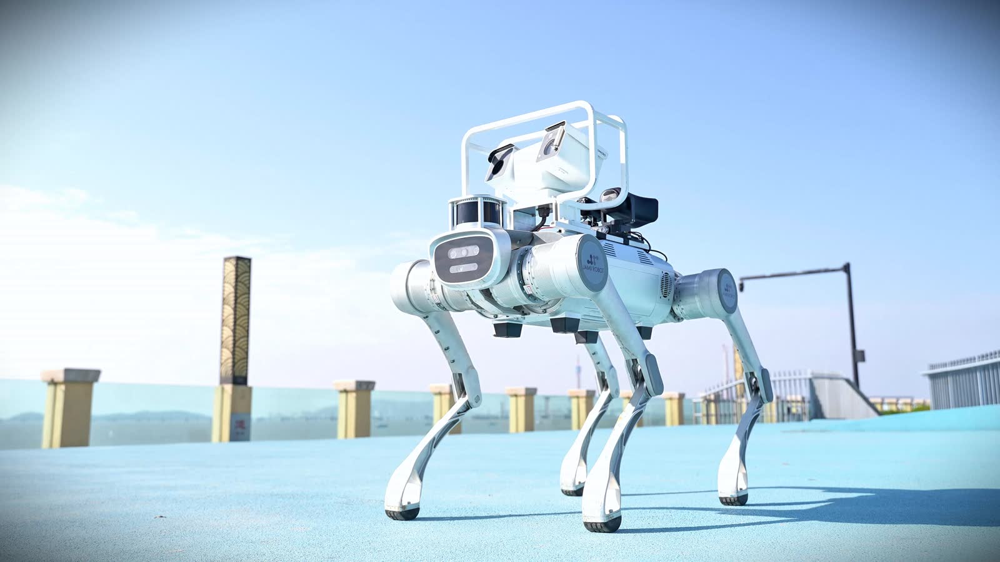
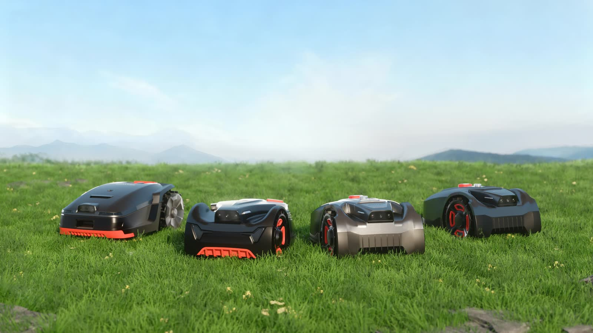

# 中坚智能 / TOPSUN-BOT

**中坚智能，让科技融入生活。**

近三十年深耕始于优化园林劳作。从植被养护到多维交互，中坚智能正把「解放双手」的命题，从地面延申至立体空间。不止是工具，更是未来生活的智能伙伴。

[TOPSUN-BOT](https://github.com/topsun-bot) 是中坚智能的开源与工程组织，沉淀智能体系统、感知定位、操作仿真与现场技能。现场工程覆盖 Unitree G1 / Go2W 二次开发、安防自主导航、机械臂集成、ROS 2 / SDK 联调与试点验收，公开入口见 [`skills`](https://github.com/topsun-bot/skills)。

---

## 功能展示

官网产品画面（本地托管，避免 OSS 防盗链）。宣传片为静音循环，GitHub 无法稳定内嵌，请在 [中坚智能官网](https://topbot.topsunpower.cc/) 观看。

<table>
  <tr>
    <td align="center" width="33%" valign="top">
      
       
      <strong>工业重载机器狗 · 灵睿 P1</strong>
       
      工业巡检 · 安防协同 · 应急救援
    </td>
    <td align="center" width="33%" valign="top">
      
       
      <strong>智能割草机器人 · GOALKER</strong>
       
      园林智能养护 · 从地面解放双手
    </td>
    <td align="center" width="34%" valign="top">
      
       
      <strong>灵睿智能机器狗 · 现场作业</strong>
       
      复杂环境巡检 · 立体空间延伸
    </td>
  </tr>
</table>

---

## 开源与工程仓库

公开仓库按方向归类。仓库名为英文代码链接，说明为中文一行。

<table>
  <thead>
    <tr>
      <th align="center">方向</th>
      <th>仓库与说明</th>
      <th align="center">Stars</th>
      <th align="center">Forks</th>
    </tr>
  </thead>
  <tbody>
    <tr>
      <td rowspan="2" align="center"><strong>智能体与系统</strong></td>
      <td>
        <a href="https://github.com/topsun-bot/topsun_dimos"><code>topsun_dimos</code></a>
         
        TOPSUN DimOS：面向物理空间的智能体操作系统，覆盖导航建图、感知、空间记忆与 MCP Skills；含 Unitree Go2 / G1 蓝图。
      </td>
      <td align="center"></td>
      <td align="center"></td>
    </tr>
    <tr>
      <td>
        <a href="https://github.com/topsun-bot/HoloAgent"><code>HoloAgent</code></a>
         
        通用机器人具身智能体框架：闭环执行、三维空间记忆与可落地技能（Horizon Robotics HoloAgent 工作副本）。
      </td>
      <td align="center"></td>
      <td align="center"></td>
    </tr>
    <tr>
      <td rowspan="5" align="center"><strong>感知与定位</strong></td>
      <td>
        <a href="https://github.com/topsun-bot/Elevator-LIO"><code>Elevator-LIO</code></a>
         
        面向电梯非惯性运动与跨楼层定位的激光惯性里程计；可关闭电梯模式作为通用 LIO。
      </td>
      <td align="center"></td>
      <td align="center"></td>
    </tr>
    <tr>
      <td>
        <a href="https://github.com/topsun-bot/Super-LIO"><code>Super-LIO</code></a>
         
        紧凑建图策略的高效鲁棒激光惯性里程计（RA-L 2026）；本仓库跟踪 ROS 2 Humble / Iron / Jazzy。
      </td>
      <td align="center"></td>
      <td align="center"></td>
    </tr>
    <tr>
      <td>
        <a href="https://github.com/topsun-bot/FAST-LIVO2"><code>FAST-LIVO2</code></a>
         
        快速直接法激光-惯性-视觉里程计，用于退化环境实时三维重建与机载定位（T-RO 2024）。
      </td>
      <td align="center"></td>
      <td align="center"></td>
    </tr>
    <tr>
      <td>
        <a href="https://github.com/topsun-bot/FASTLIO2_ROS2"><code>FASTLIO2_ROS2</code></a>
         
        FAST-LIO2 的 ROS 2 Humble 实现，含回环位姿图优化、两阶段 ICP 重定位与一致性地图精修（BA / HBA）。
      </td>
      <td align="center"></td>
      <td align="center"></td>
    </tr>
    <tr>
      <td>
        <a href="https://github.com/topsun-bot/livox_ros_driver2"><code>livox_ros_driver2</code></a>
         
        Livox ROS / ROS 2 驱动（HAP、Mid-360），作为 LIO 栈的传感器前端。
      </td>
      <td align="center"></td>
      <td align="center"></td>
    </tr>
    <tr>
      <td rowspan="3" align="center"><strong>操作与仿真</strong></td>
      <td>
        <a href="https://github.com/topsun-bot/Panthera-HT"><code>Panthera-HT</code></a>
         
        Panthera-HT 六自由度机械臂工作区：C++ / Python SDK、Host 数字孪生（Three.js + Flask）与实机控制笔记。
      </td>
      <td align="center"></td>
      <td align="center"></td>
    </tr>
    <tr>
      <td>
        <a href="https://github.com/topsun-bot/calibration"><code>calibration</code></a>
         
        眼在手外自标定、YOLO 三维检测与 Unitree D1 抓取放置，支持 MuJoCo 与 RealSense。
      </td>
      <td align="center"></td>
      <td align="center"></td>
    </tr>
    <tr>
      <td>
        <a href="https://github.com/topsun-bot/sim"><code>sim</code></a>
         
        D1 主从臂 MCAP 物理回放（MuJoCo / Isaac Sim 5.1），用于闭环对比录制轨迹。
      </td>
      <td align="center"></td>
      <td align="center"></td>
    </tr>
    <tr>
      <td align="center"><strong>现场技能</strong></td>
      <td>
        <a href="https://github.com/topsun-bot/skills"><code>skills</code></a>
         
        自研机器人工程 Skills，亦为现场工程公开技术入口：宇树 G1 / Go2W 预检、安防巡检验收与相关现场流程。
      </td>
      <td align="center"></td>
      <td align="center"></td>
    </tr>
  </tbody>
</table>

未列入：空的 LeRobot 镜像，以及与具身产品无直接关系的工具仓。

---

## 内部 / 私有仓库

组织成员可见；公开访客打开会 404，属预期行为。本环境的 GitHub 令牌无法枚举私有仓库 README，故仅列出既有内部仓名称与可见性，不杜撰功能或指标。

<table>
  <thead>
    <tr>
      <th>仓库</th>
      <th align="center">可见性</th>
      <th>说明</th>
    </tr>
  </thead>
  <tbody>
    <tr>
      <td><a href="https://github.com/topsun-bot/Robot-Brain"><code>Robot-Brain</code></a></td>
      <td align="center"></td>
      <td>内部仓库（组织成员可见）</td>
    </tr>
    <tr>
      <td><a href="https://github.com/topsun-bot/topsun-robot-service"><code>topsun-robot-service</code></a></td>
      <td align="center"></td>
      <td>内部仓库（组织成员可见）</td>
    </tr>
    <tr>
      <td><a href="https://github.com/topsun-bot/Navigation"><code>Navigation</code></a></td>
      <td align="center"></td>
      <td>内部仓库（组织成员可见）</td>
    </tr>
  </tbody>
</table>

---

[官网](https://topbot.topsunpower.cc/) · [邮箱 hello@topsunpower.cc](mailto:hello@topsunpower.cc) · [GitHub](https://github.com/topsun-bot)

现场 Skills 含独立集成、预检与验收方法，**不属于宇树 / Unitree 官方支持或官方认证**；演示、离线检查或文档证据不表述为量产、客户案例或真机验收。

